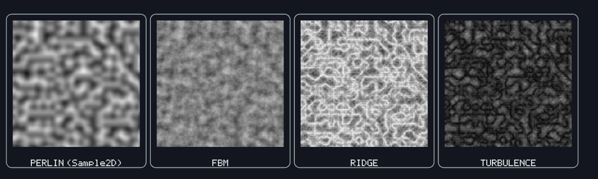

# Noise — Guide

`Noise` (namespace `MonoPrimitives`, file [`src/Core/Noise.cs`](../src/Core/Noise.cs)) is seedable gradient (Perlin-style) noise — smooth, deterministic pseudo-randomness for terrain heightmaps, procedural texture-like effects, or any "organic" variation that should look continuous rather than static-y. The core algorithm is a direct, line-by-line match of Ken Perlin's own "improved noise" (2002) reference implementation.


<br><sub>Same seed and octave count throughout — the visible difference is purely each variant's own formula: fBm is smooth/cloudy, ridge traces bright veins, turbulence stays sharp and billowy.</sub>

## Quick start

```csharp
using MonoPrimitives;

var noise = new Noise(seed: 42); // construct once per seed, reuse -- the seed only costs a one-time permutation shuffle

float n = noise.Sample2D(x * 0.05f, y * 0.05f); // roughly [-1, 1]
float terrain = noise.Fbm2D(x * 0.02f, y * 0.02f); // rougher, more natural-looking than a single sample
```

Construct one `Noise` per seed and keep it — the same lifecycle as `RandomUtil`/`PrimitiveInput`. Output is roughly in `[-1, 1]` (not hard-clamped — gradient noise can slightly overshoot at some inputs, same as any standard Perlin implementation).

## Raw samples

| Method | What it does |
|---|---|
| `Sample1D(x)` | 1D noise — a smooth, deterministic "wander" over one variable: a steering angle drifting over time, wind gust strength, camera shake, anywhere you'd otherwise reach for a random walk but want continuity instead of jitter. Uses its own dedicated 1D gradient, not a slice of `Sample3D` — see "Why Sample1D is special" below. |
| `Sample2D(x, y)` | 2D noise — a `z=0` slice of `Sample3D`, the standard way to specialize Perlin noise down a dimension. |
| `Sample3D(x, y, z)` | 3D noise — the full implementation everything else is built from. |

## Fractal Brownian motion (fBm) and its variants

All three families below sum multiple **octaves** of the raw samples above at increasing frequency and decreasing amplitude — rougher, more natural-looking output than a single noise octave, normalized back to roughly the same range regardless of octave count.

| Method | What it does | Natural range |
|---|---|---|
| `Fbm1D(x)` / `Fbm2D(x, y)` / `Fbm3D(x, y, z)` | Standard fBm: sums the signed sample per octave. Smooth rolling hills. | `[-1, 1]`, like the raw samples |
| `RidgeNoise2D(x, y)` / `RidgeNoise3D(x, y, z)` | Each octave folds through `(1 - \|sample\|)²` before summing — values near a lattice's zero-crossings become sharp ridges instead of smooth hills. The standard look for mountain-ridge terrain. | roughly `[0, 1]` — squaring an already-nonnegative value can't go negative |
| `Turbulence2D(x, y)` / `Turbulence3D(x, y, z)` | Sums `\|sample\|` per octave instead of the signed value — a rougher, "billowy" look (creases at every zero-crossing instead of smooth troughs), without Ridge's sharpening square. | roughly `[0, 1]`, same as Ridge |

Rendered side by side at the same coordinates, `RidgeNoise2D` reads as a network of sharp, bright ridgelines; `Turbulence2D` reads as softer, rounder billows — see `examples/test/NoiseTest`, scene 4 (key `4`).

### Octaves, Lacunarity, Gain — instance properties, not per-call arguments

```csharp
var noise = new Noise(seed: 42, octaves: 6, lacunarity: 2.1f, gain: 0.45f);
noise.Octaves = 4; // still editable afterward
```

| Property | Default | What it controls |
|---|---|---|
| `Octaves` | `4` | How many noise layers are summed. More octaves = more fine detail, at proportionally more cost per sample. `0` returns exactly `0`. |
| `Lacunarity` | `2f` | Frequency multiplier applied each octave — how much finer detail each successive layer adds. |
| `Gain` | `0.5f` | Amplitude multiplier applied each octave — how much each finer layer contributes to the total. |

These are set once (at construction or afterward) rather than passed to every `Fbm2D`/`RidgeNoise2D`/`Turbulence2D` call — the same shape `Camera2D.MoveSpeed` or `PrimitiveInput.DoubleClickTime` already use for a tunable knob that's normally consistent across an entire terrain/effect, not varied call-to-call. If you genuinely need two different fBm configurations sampling the *same* underlying gradient field, construct a second `Noise` with the same seed — cheap, since seeding only costs a one-time permutation-table shuffle.

## Why `Sample1D` is special

`Sample1D` is deliberately **not** a `y=0, z=0` slice of `Sample3D` the way `Sample2D` is a `z=0` slice. The internal 12-direction gradient table (`Grad`) has several hash cases whose x-facing component actually reads `y` or `z` instead of `x`; pinning *both* to zero would make those cases evaluate to exactly zero — around 23% near-zero output versus 2% for a normal 2D/3D sample, far more "flat" dead regions than real noise should have. `Sample1D` uses its own dedicated 1D gradient (±1 per hash bit, the standard approach for 1D Perlin noise) instead, which has no such degenerate case — reach for it rather than hand-rolling a `Sample3D(x, 0, 0)` call yourself.

## Testing

Every method above has a permanent regression check in [`tests/MonoPrimitives.Tests/NoiseTests.cs`](../tests/MonoPrimitives.Tests/NoiseTests.cs): determinism, range, the `Sample1D` fix above, **continuity** (a tiny input step should only change the output by a bounded amount — the whole point of gradient noise), and continuity specifically across negative coordinates, where the lattice-wrap trick is easy to break with an "obvious" simplification. Run with:

```bash
dotnet run --project tests/MonoPrimitives.Tests/MonoPrimitives.Tests.csproj
```

## Limitations

No Simplex, Cellular/Worley, or Value noise, no domain warping, no alternate fractal modes — that's a whole multi-algorithm noise engine, out of scope here. `RidgeNoise`/`Turbulence` are the one addition, and they're not a new algorithm, just different ways of combining the same `Sample1D/2D/3D` octaves `Fbm*` already uses.
