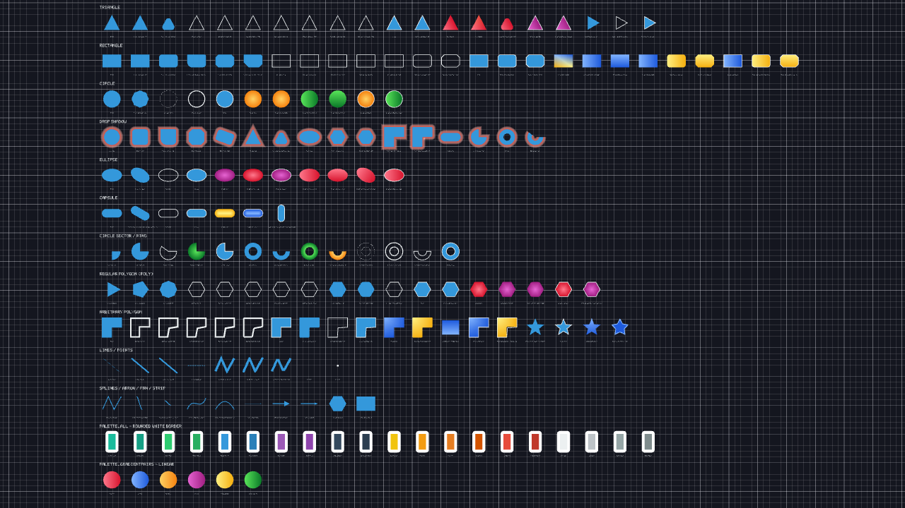

# Primitive2DBatch — Guide

`Primitive2DBatch` (namespace `MonoPrimitives.Primitives2D`, file [`src/2D/Primitives2D.cs`](../src/2D/Primitives2D.cs)) is an immediate-mode 2D primitive renderer for MonoGame — every shape you'd otherwise hand-triangulate yourself (rectangles, circles, polygons, capsules, sectors/rings, splines) drawn with a `SpriteBatch`-like API, buffered into one shared vertex/index buffer and submitted in as few draw calls as possible.

This guide covers every public method, grouped by shape family, plus the handful of conventions that apply across all of them and the non-obvious mechanics behind gradients, shadows, and segment counts. For per-parameter detail beyond what's here, the XML doc comments on each method in `Primitives2D.cs` go deeper.


<br><sub>`samples/MonoPrimitives.Sample`'s `Gallery2D` — every shape below, rendered.</sub>

## Quick start

```csharp
using MonoPrimitives.Primitives2D;

private Primitive2DBatch _batch;

protected override void LoadContent()
{
    _batch = new Primitive2DBatch(GraphicsDevice); // one instance, reused every frame
}

protected override void Draw(GameTime gameTime)
{
    _batch.Begin(); // or Begin(camera.GetViewMatrix()) for a scrolling/zooming camera
    _batch.FillCircle(new Vector2(400, 300), 50, Color.Red);
    _batch.DrawRectangle(100, 100, 200, 80, Color.White, Color.Black, thickness: 4);
    _batch.End();
    base.Draw(gameTime);
}
```

Construct one `Primitive2DBatch` per `GraphicsDevice` and keep it — never allocate a new one per frame, since its internal buffers are allocated once in the constructor and reused. Wrap every frame's drawing in `Begin`/`End`.

| Method | What it does |
|---|---|
| `Begin()` / `Begin(transformMatrix, blendState, depthStencilState, rasterizerState, effect)` | Starts a batch. The camera transform is the **first** parameter so `Begin(camera.GetViewMatrix())` reads naturally. The longer overload mirrors `SpriteBatch`'s own state-override pattern; omit anything you don't need to override. |
| `End()` | Submits any buffered geometry and restores device state. |
| `Flush()` | Submits buffered geometry immediately **without** ending the batch — use this if you need to interleave primitive drawing with something else that also touches the `GraphicsDevice` mid-batch. |
| `ClearLetterboxed(adapter, barColor = null, backgroundColor = null)` | Clears the window for a letterboxed/pillarboxed `ViewportAdapter2D` (typically `BoxingViewportAdapter2D`) — bars in `barColor` (default `Color.Black`), the boxed "inside" in `backgroundColor` (defaults to `barColor` when omitted, so a bare `ClearLetterboxed(adapter)` is just a plain single-color clear). Call once per frame **before** your own scene's `Begin()` — it runs its own internal `Begin`/`End` to paint the background rectangle. Exists because `GraphicsDevice.Clear()` ignores a narrowed viewport and always clears the whole render target, so a plain "clear bars, then clear again for a different inside color" doesn't work — see `ViewportAdapter2D.Apply()`'s doc comment for the manual version of this recipe. |
| `Dispose()` | Releases the internal effect. Dispose the batch itself when your game/screen shuts down, same as a `SpriteBatch`/`GraphicsDevice` resource. |
| `Effect` | The `BasicEffect` this batch draws with — constructed internally, so this is the only way to reach it. Tweak a parameter this batch's own API has no call for (`Effect.Alpha` for a global fade, `Effect.FogEnabled`, etc.); don't touch `VertexColorEnabled`/`TextureEnabled`/`World`, which this batch depends on staying as constructed. For swapping the effect entirely, use `Begin`'s own `effect` parameter instead. |

## Core conventions (read this once)

**Fill / Border / Draw.** Every closed shape follows the same three-verb pattern:
- `Fill<Shape>` — solid color, no outline.
- `Border<Shape>` — outline only, growing **inward** from the shape's own edge. A thick border on a small shape never pokes outside it — it clamps and degrades gracefully toward a full fill instead.
- `Draw<Shape>` — both together. One overload takes a single `Color` (fill and border match); another takes `fillColor, borderColor` separately.

Raw multi-point mesh primitives with no natural "inside" (`DrawTriangleFan`, `DrawTriangleStrip`) keep a single `Draw` name, since there's nothing to separately border. Sectors and rings (`FillCircleSector`/`BorderCircleSector`/`DrawCircleSector`, `FillRing`/`BorderRing`/`DrawRing`) follow the same three-verb pattern too — see Sectors and rings below.

**Rotation.** Shapes with a meaningful orientation (Triangle, Rectangle, Ellipse, regular Poly, Capsule) take an optional trailing `float rotation = 0f` in **radians**, pivoting on the shape's own center unless you pass an explicit `Vector2? origin` (an offset from the shape's own position, not an absolute world coordinate). Shapes that look identical at any rotation (a solid or radially-graded Circle) have no rotation parameter at all — it would be a no-op. Arbitrary `Polygon`s (your own point list) and the regular `Poly` family don't take a separate `origin` either — a regular polygon always pivots on its own center, and an arbitrary polygon is already fully described by its points.

One different unit convention to know: `startAngle`/`endAngle` on every Sector/Ring method (`FillCircleSector`/`FillCircleSectorGradient`/`BorderCircleSector`/`DrawCircleSector`/`FillCircleSectorShadow`/`FillRing`/`FillRingGradient`/`BorderRing`/`DrawRing`/`FillRingShadow`) are normalized **turns** in `[0, 1]` (`1` = a full circle), not radians and not degrees. This is unrelated to the `rotation` parameter's radians and is easy to trip over the first time — `endAngle: 0.25f` is a quarter turn, not 0.25 radians.

**Thickness and joins.** `Border*`/`Draw*` methods that can have sharp corners take `LineJoin join = LineJoin.Miter` (sharp, cheapest) or `LineJoin.Round`/`LineJoin.Bevel` (with an optional `float? jointRadius` to control how rounded/beveled the join is). Miter is fast and exact for most UI-style shapes; Round costs more triangles but looks right on large, soft shapes. Lines have their own related but separate concept, `LineCap` (`Butt`/`Round`), for how an *open* stroke's free end is finished.

**Gradients.** `Fill<Shape>Gradient` (fill only) and `Draw<Shape>Gradient` (fill + border) exist for every shape family. In `Draw*Gradient`, the gradient fill always stops exactly where the border begins — for a circle of `radius` with `thickness`, the fill runs from the center out to `radius - thickness`. Most gradient methods also take `innerOffset`/`outerOffset`: solid-color margins before/after the actual fade. If the two would overlap (their sum exceeds the available space), both are scaled down proportionally rather than producing an inverted or negative fade — consistent across every gradient method in the file. Two distinct gradient *shapes* exist, and the parameter names tell you which one a method uses:
- **Radial** (center → rim): parameters are named `inner`/`outer` (or `innerFill`/`outerFill` alongside a separate `borderColor`). `FillCircleGradient`, `FillEllipseGradient`, `FillPolyGradient`, `FillCapsuleGradient`, `FillRingGradient` (band-width fade, not center-based, but same naming since there's still an inner/outer edge).
- **Directional/linear** (a straight fade along one axis, or point-to-point): parameters are named `from`/`to`. `FillTriangleGradient`, `FillRectangleGradient`, `FillCircleGradientLinear`, `FillEllipseGradientLinear`, `FillPolygonGradient`.

**Shadows.** `Fill<Shape>Shadow` draws the shape's own solid fill plus a soft halo glowing outward from its boundary by `spread` pixels, fading from `color` at the edge to transparent at the outer edge of the halo — see the dedicated Shadows section below for how these are built and their one documented limitation.

**Overload families.** Most shapes accept their position/size either as separate `float` components, a `Vector2 position, Vector2 size` pair, or a `Rectangle` — pick whichever is most convenient at the call site; they all forward to the same implementation. Endpoint-based shapes (Capsule) additionally offer a `center, length, rotation` overload alongside their natural `start, end` form — see Capsules below.

**`RectCorners`.** Used for `FillRectangleRounded`'s `radius`, `FillRectangleChamfer`'s `chamfer`, and their respective shadow variants — one value per corner (`TopLeft`/`TopRight`/`BottomRight`/`BottomLeft`, clockwise), with an implicit conversion from a single `float` when you want the same value on all four corners: `batch.FillRectangleRounded(rect, 12f, Color.White)`.

---

## Points and pixels

The one family deliberately **not** part of the Fill/Border/Draw system — raw, single-vertex primitives for the cheapest possible dot.

| Method | What it does |
|---|---|
| `DrawPixel(Vector2 \| float x, y, Color)` | A single 1×1 pixel. |
| `DrawPixelFast(Vector2, Color)` | Same, on the fastest internal path — use for large numbers of pixels (particle-style effects). |
| `DrawPoint(Vector2 position, float size, Color)` | A filled square dot of the given size — a bigger, more visible pixel. |

## Lines

Stroke primitives — no Fill/Border split, since a line has no "inside." `thickness` comes **before** `color` here, unlike shape primitives where `color` follows the geometry directly.

| Method | What it does |
|---|---|
| `DrawLine(start, end, color)` | A 1px line. |
| `DrawLine(start, end, thickness, color)` | A thick line. |
| `DrawLine(start, end, thickness, color, LineCap cap)` | Thick line with an explicit cap style (`Butt`, `Round`). |
| `DrawLine(x1, y1, x2, y2, color)` / `DrawLine(x1, y1, x2, y2, thickness, color)` | Same, from raw floats instead of `Vector2`s. |
| `DrawLineStrip(points, color)` / `DrawLineStrip(points, thickness, color, join, cap, jointRadius)` | A connected polyline through any number of points, with proper mitered/rounded/beveled joints at each corner instead of independent overlapping segments. |
| `DrawLineDashed(start, end, dashLength, gapLength, color)` / `(..., thickness, color)` | A dashed line. |
| `DrawArrow(start, end, color, thickness = 2f, headLength?, headWidth?, cap = LineCap.Butt, headCornerRadius = 0f)` | A line with a triangular arrowhead at `end`. `headLength`/`headWidth` default to a size proportional to `thickness` if omitted. `cap` finishes the shaft's free end (only meaningful when the shaft is visibly shorter than `headLength`); `headCornerRadius` rounds the arrowhead's corners — keep it small relative to the head's own size, since a large radius blobs the triangle out into a rounded shape rather than reading as an arrowhead. |

## Triangles

| Method | What it does |
|---|---|
| `FillTriangle(v1, v2, v3, color, rotation, origin)` | Solid triangle. |
| `FillTriangle(v1, c1, v2, c2, v3, c3, rotation, origin)` | Solid triangle with an independent color per vertex (a 3-point gradient). |
| `BorderTriangle(v1, v2, v3, color, thickness, rotation, origin, join, jointRadius)` | Outline only, inward. |
| `DrawTriangle(v1, v2, v3, fillColor, borderColor = null, thickness, rotation, origin, join, jointRadius)` | Fill + border — omit `borderColor` for the same color on both. |
| `FillTriangleRounded(v1, v2, v3, cornerRadius, color, rotation, origin)` | Solid triangle with rounded corners. |
| `BorderTriangleRounded(v1, v2, v3, cornerRadius, color, thickness, rotation, origin)` | Rounded-corner outline only. |
| `DrawTriangleRounded(v1, v2, v3, cornerRadius, fillColor, borderColor = null, thickness, rotation, origin)` | Rounded-corner fill + border — omit `borderColor` for the same color on both. |
| `FillTriangleGradient(v1, v2, v3, from, to, rotation, origin)` | `v1` → `from`, `v2` and `v3` → `to`. |
| `FillTriangleGradientRounded(v1, v2, v3, cornerRadius, from, to, rotation, origin)` | Same gradient, rounded corners. |
| `DrawTriangleGradient(v1, v2, v3, from, to, borderColor, thickness, rotation, origin, join, jointRadius)` | Gradient fill + solid border, fill inset so it stops at the border. |
| `DrawTriangleGradientRounded(v1, v2, v3, cornerRadius, from, to, borderColor, thickness, rotation, origin)` | Same, rounded corners. |
| `FillTriangleShadow(v1, v2, v3, color, spread, rotation, origin)` | Solid triangle with a soft outward drop shadow. |
| `FillTriangleShadowRounded(v1, v2, v3, cornerRadius, color, spread, rotation, origin)` | Same, rounded corners. |
| `FillTriangle(center, radius, color, rotation)` / `BorderTriangle(center, radius, color, thickness, rotation, join, jointRadius)` / `DrawTriangle(center, radius, fillColor, borderColor = null, thickness, rotation, join, jointRadius)` | An equilateral triangle inscribed in a circle of `radius` — shorthand for `FillPoly`/`BorderPoly`/`DrawPoly` with `sides: 3`. `rotation = 0` points along +X, same convention as `FillPoly`. |
| `DrawTriangleFan(points, color)` | Raw triangle fan from the first point — for arbitrary fan-shaped meshes, not a "triangle" in the geometric sense. |
| `DrawTriangleStrip(points, color)` | Raw triangle strip. |

Rotation on a triangle is a bit redundant (you already control its shape via `v1`/`v2`/`v3`) but is included for consistency with every other shape family, and because it's occasionally convenient to spin an already-built triangle around a pivot without recomputing its three points by hand.

## Rectangles

Three corner families, all sharing the same Fill/Border/Draw/Gradient/Shadow pattern: **plain** (sharp corners), **Rounded** (per-corner radius), **Chamfer** (per-corner diagonal cut).

### Plain rectangles

| Method | What it does |
|---|---|
| `FillRectangle(x, y, w, h \| position, size \| rect, color, rotation, origin)` | Solid rectangle. |
| `FillRectangle(x, y, w, h \| position, size \| rect, topLeft, topRight, bottomRight, bottomLeft, rotation, origin)` | Solid rectangle with an independent color per corner — for a gradient that isn't a plain 2-stop fade. The quad is 2 triangles sharing the `topLeft`-`bottomRight` diagonal, so a point exactly on that diagonal (e.g. dead center) blends only those 2 corners, not all 4 (standard triangulated-quad behavior, not true bilinear). |
| `BorderRectangle(..., color, thickness, rotation, origin, join, jointRadius)` | Outline only, inward. |
| `DrawRectangle(..., fillColor, borderColor = null, thickness, rotation, origin, join, jointRadius)` | Fill + border — omit `borderColor` for the same color on both. |
| `FillRectangleGradient(..., from, to, horizontal, rotation, origin, innerOffset, outerOffset)` | Linear gradient fill, `horizontal` picks the fade axis. |
| `DrawRectangleGradient(..., from, to, horizontal, borderColor, thickness, rotation, origin, innerOffset, outerOffset)` | Gradient fill (inset by `thickness`) + solid border, both rotating together about the same pivot. |
| `FillRectangleShadow(rect \| position, size, RectCorners radius, color, spread, rotation, origin)` | Solid rectangle (optionally rounded via `radius`) with a soft outward drop shadow. Pass `0f` for `radius` for a sharp-cornered shadow. |

### Rounded rectangles

Same verbs, with an extra `RectCorners radius` parameter right after the geometry. Each corner's radius is independently clamped to half the shorter side.

| Method | What it does |
|---|---|
| `FillRectangleRounded`, `BorderRectangleRounded`, `DrawRectangleRounded` | Same signatures as their plain counterparts, plus `radius`. |
| `FillRectangleGradientRounded`, `DrawRectangleGradientRounded` | Gradient variants — note the suffix order: **Gradient before Rounded**, matching every other shape family's `*GradientRounded` naming (Triangle, Poly, Polygon). |

### Chamfered rectangles

Same again, with `RectCorners chamfer` instead of `radius` — a straight diagonal cut instead of a rounded arc.

| Method | What it does |
|---|---|
| `FillRectangleChamfer`, `BorderRectangleChamfer`, `DrawRectangleChamfer` | Same signatures as plain, plus `chamfer`. |
| `FillRectangleGradientChamfer`, `DrawRectangleGradientChamfer` | Gradient variants (Gradient before Chamfer, same reasoning as Rounded above). |
| `FillRectangleChamferShadow(rect \| position, size, RectCorners chamfer, color, spread, rotation, origin)` | Chamfered rectangle with a soft outward drop shadow. |

## Circles

Plain circles have **no rotation parameter anywhere** — a solid or radially-graded circle looks identical at any angle, so it would be a no-op.

| Method | What it does |
|---|---|
| `FillCircle(center, radius, color)` / `FillCircle(x, y, radius, color)` | Solid circle. |
| `FillCircle(center, radius, segments, color)` | Solid circle with an explicit segment count (normally chosen automatically from the radius — see "Segment counts" below). |
| `BorderCircle(center, radius, color, thickness)` | Outline only. |
| `DrawCircle(center, radius, fillColor, borderColor = null, thickness)` | Fill + border — omit `borderColor` for the same color on both. |
| `FillCircleGradient(center, radius, inner, outer, innerOffset, outerOffset)` | Radial gradient, center → rim. |
| `DrawCircleGradient(center, radius, innerFill, outerFill, borderColor, thickness, innerOffset, outerOffset)` | Radial gradient + border. |
| `FillCircleGradientLinear(center, radius, from, to, horizontal, rotation, innerOffset, outerOffset)` | A **straight** (non-radial) gradient across the circle — `horizontal` picks the default axis, `rotation` turns it, so a top-to-bottom fade is just `horizontal: false`. |
| `DrawCircleGradientLinear(center, radius, from, to, borderColor, horizontal, thickness, rotation, innerOffset, outerOffset)` | Linear gradient + border. |
| `FillCircleShadow(center, radius, color, spread)` | Solid circle with a soft outward drop shadow — internally just a `FillCircleGradient` wrapper, since a radial gradient already produces exactly this fade. |

## Ellipses

Ellipses **do** take a `rotation` parameter (radians) on every method — unlike a circle, tilting an ellipse's H/V axes is the only way to orient it at all.

| Method | What it does |
|---|---|
| `FillEllipse(center, radiusH, radiusV, color, rotation)` | Solid ellipse. |
| `FillEllipse(center, radiusH, radiusV, segments, inner, outer, rotation)` | Radial-gradient fan version with an explicit segment count. |
| `BorderEllipse(center, radiusH, radiusV, color, thickness, rotation)` | Outline only. |
| `DrawEllipse(center, radiusH, radiusV, fillColor, borderColor = null, thickness, rotation)` | Fill + border — omit `borderColor` for the same color on both. |
| `FillEllipseGradient(center, radiusH, radiusV, inner, outer, rotation, innerOffset, outerOffset)` | Radial gradient. |
| `DrawEllipseGradient(center, radiusH, radiusV, innerFill, outerFill, borderColor, thickness, rotation, innerOffset, outerOffset)` | Radial gradient + border. |
| `FillEllipseGradientLinear(center, radiusH, radiusV, from, to, horizontal, rotation, innerOffset, outerOffset)` | Straight gradient. `rotation` does **double duty** here — it tilts both the ellipse's own H/V axes *and* the gradient's reading axis together, unlike `FillCircleGradientLinear` (where only the axis rotates, since a circle has no shape-orientation of its own to lock the gradient to). |
| `DrawEllipseGradientLinear(center, radiusH, radiusV, from, to, borderColor, horizontal, thickness, rotation, innerOffset, outerOffset)` | Linear gradient + border. |
| `FillEllipseShadow(center, radiusH, radiusV, color, spread, rotation)` | Solid ellipse with a soft outward drop shadow. |

## Capsules

A stadium shape: two round end caps joined by a straight body — the shape `DrawLine(..., LineCap.Round)` already draws internally, exposed here as its own Fill/Border/Draw family. Every method has **two overloads**: an endpoint pair (`start, end`) — the geometry's natural, most convenient form for chain links/ropes/limbs — and a `center, length, rotation` form matching every other shape's "center + size + rotation" convention. Both forward to the same implementation (`CapsuleEndpointsFromCenter` converts the second form to the first). Passing `start == end` (or `length: 0`) degenerates cleanly to the matching `*Circle`/`*CircleGradient`/`*CircleShadow` method rather than producing degenerate geometry.

| Method | What it does |
|---|---|
| `FillCapsule(start, end, radius, color)` / `FillCapsule(center, length, radius, color, rotation)` | Solid capsule. |
| `BorderCapsule(start, end, radius, color, thickness)` / `BorderCapsule(center, length, radius, color, thickness, rotation)` | Outline only, inward. |
| `DrawCapsule(start, end, radius, fillColor, borderColor = null, thickness)` / `DrawCapsule(center, length, radius, fillColor, borderColor = null, thickness, rotation)` | Fill + border — omit `borderColor` for the same color on both. |
| `FillCapsuleGradient(start, end, radius, inner, outer)` / `FillCapsuleGradient(center, length, radius, inner, outer, rotation)` | Gradient measured from the capsule's own axis **segment**, not a single point — every boundary vertex fades from whichever pole (`start` or `end`) its own cap arc surrounds, so the straight-side quads interpolate the true closest-point-to-segment distance exactly, not an approximation of it. |
| `DrawCapsuleGradient(start, end, radius, innerFill, outerFill, borderColor, thickness)` / `DrawCapsuleGradient(center, length, radius, innerFill, outerFill, borderColor, thickness, rotation)` | Gradient fill + border. |
| `FillCapsuleShadow(start, end, radius, color, spread)` / `FillCapsuleShadow(center, length, radius, color, spread, rotation)` | Solid capsule with a soft outward drop shadow. |

## Regular polygons (Poly — N equal sides)

A triangle/square/hexagon/etc. defined by a center, side count, and radius. `rotation` is radians; there's no separate `origin` parameter — a regular polygon always pivots on its own center.

| Method | What it does |
|---|---|
| `FillPoly(center, sides, radius, color, rotation)` | Solid N-gon. |
| `BorderPoly(center, sides, radius, color, thickness, rotation, join, jointRadius)` | Outline only. |
| `DrawPoly(center, sides, radius, fillColor, borderColor = null, thickness, rotation, join, jointRadius)` | Fill + border — omit `borderColor` for the same color on both. |
| `FillPolyRounded(center, sides, radius, cornerRadius, color, rotation)` | Solid N-gon with rounded corners — the same capability `BorderPoly`/`DrawPoly`'s `join: LineJoin.Round` already gave the outline, exposed under a discoverable standalone name matching Triangle/Rectangle/Polygon. |
| `BorderPolyRounded(center, sides, radius, cornerRadius, color, thickness, rotation)` | Rounded-corner outline only. |
| `DrawPolyRounded(center, sides, radius, cornerRadius, fillColor, borderColor = null, thickness, rotation)` | Rounded-corner fill + border — omit `borderColor` for the same color on both. |
| `FillPolyGradient(center, sides, radius, inner, outer, rotation, innerOffset, outerOffset)` | Radial gradient. |
| `FillPolyGradientRounded(center, sides, radius, cornerRadius, inner, outer, rotation)` | Same gradient, rounded corners (no `innerOffset`/`outerOffset` here — matches `FillTriangleGradientRounded`'s simpler rounded-corner variant). |
| `DrawPolyGradient(center, sides, radius, innerFill, outerFill, borderColor, thickness, rotation, innerOffset, outerOffset)` | Radial gradient + border. |
| `DrawPolyGradientRounded(center, sides, radius, cornerRadius, innerFill, outerFill, borderColor, thickness, rotation)` | Same, rounded corners. |
| `FillPolyShadow(center, sides, radius, color, spread, rotation)` | Solid N-gon with a soft outward drop shadow. |
| `FillPolyShadowRounded(center, sides, radius, cornerRadius, color, spread, rotation)` | Same, rounded corners. |

## Arbitrary polygons (Polygon — your own point list)

Takes a `ReadOnlySpan<Vector2>` of points instead of center/sides/radius — draw whatever shape you've computed yourself. **Assumes a convex or star-shaped-from-the-first-point input** (fan-triangulated from `points[0]`); a general non-convex polygon can render wrong. No general ear-clipping triangulation is implemented — a documented scope limit, not a silent bug. A concave (reflex) corner also has one specific, documented limitation for the `*Rounded`/`*Shadow` variants — see the Shadows section and [`Design/ROADMAP.md`](../Design/ROADMAP.md).

| Method | What it does |
|---|---|
| `FillPolygon(points, color)` | Solid fill, fan-triangulated from `points[0]`. |
| `BorderPolygon(points, color, thickness, join, jointRadius)` | Outline only, inward — correct for concave (reflex-vertex) input too, not just convex (see `Design/DECISIONS.md`). |
| `DrawPolygon(points, fillColor, borderColor = null, thickness, join, jointRadius)` | Fill + border — omit `borderColor` for the same color on both. |
| `FillPolygonRounded(points, cornerRadius, color)` | Solid fill with every corner rounded. |
| `BorderPolygonRounded(points, cornerRadius, color, thickness)` | Rounded-corner outline only. |
| `DrawPolygonRounded(points, cornerRadius, fillColor, borderColor = null, thickness)` | Rounded-corner fill + border — omit `borderColor` for the same color on both. |
| `FillPolygonGradient(points, from, to)` | `points[0]` → `from`, every other point → `to`. |
| `FillPolygonGradientRounded(points, cornerRadius, from, to)` | Same gradient, rounded corners. |
| `DrawPolygonGradient(points, from, to, borderColor, thickness, join, jointRadius)` | Gradient fill (inset by `thickness`) + border. |
| `DrawPolygonGradientRounded(points, cornerRadius, from, to, borderColor, thickness)` | Same, rounded corners. |
| `FillPolygonGradientTopBottom(bottomPoints, topPoints, bottomColor, topColor)` | A gradient **ribbon** between two aligned point lists — `bottomPoints[i]` connects to `topPoints[i]`, fading from `bottomColor` to `topColor`. Useful for a fade that follows an arbitrary profile (e.g. a terrain silhouette) instead of a straight axis. If the two lists differ in length, the shorter one wins. |
| `FillPolygonShadow(points, color, spread)` | Solid fill with a soft outward drop shadow. Shares the reflex-vertex caveat below on a concave input. |
| `FillPolygonShadowRounded(points, cornerRadius, color, spread)` | Same, rounded corners — rounding a reflex corner leaves it concave, just an arc instead of a sharp point, not a fix for the underlying limitation. |

## Sectors and rings

Same Fill/Border/Draw pattern as every other shape. Remember: `startAngle`/`endAngle` here are normalized **turns** `[0, 1]`, not radians.

| Method | What it does |
|---|---|
| `FillCircleSector(center, radius, startAngle, endAngle, [segments,] color)` | A filled pie slice. |
| `FillCircleSectorGradient(center, radius, startAngle, endAngle, [segments,] inner, outer)` | Radial-gradient pie slice, center → rim. |
| `BorderCircleSector(center, radius, startAngle, endAngle, thickness, color)` | The pie slice's outline (arc + the two straight radii). |
| `DrawCircleSector(center, radius, startAngle, endAngle, [segments,] fillColor, borderColor = null, thickness = 1f)` | Fill + border together — omit `borderColor` for the same color on both. |
| `FillCircleSectorShadow(center, radius, startAngle, endAngle, color, spread)` | Pie slice with a soft outward drop shadow. Special-cases a full-turn sweep (no center-point "spike," since a full circle has no radial cut edges to shadow). |
| `FillRing(center, innerRadius, outerRadius, [startAngle, endAngle, segments,] color)` | A filled annulus (donut), or a partial donut wedge if you pass an angle range. `innerRadius <= 0` degenerates to a sector. |
| `FillRingGradient(center, innerRadius, outerRadius, [startAngle, endAngle, segments,] innerColor, outerColor)` | Same, with a radial fade across the band's own width (inner edge → outer edge — a ring has no center point within its filled area to fade from). |
| `BorderRing(center, innerRadius, outerRadius, [startAngle, endAngle, segments,] color, thickness)` | The ring's outline: outer + inner arcs, plus (for a partial ring) the two straight radial edges. |
| `DrawRing(center, innerRadius, outerRadius, [startAngle, endAngle, segments,] fillColor, borderColor = null, thickness = 1f)` | Fill + border together — omit `borderColor` for the same color on both. |
| `FillRingShadow(center, innerRadius, outerRadius, startAngle, endAngle, color, spread)` | Ring (or partial wedge) with a soft outward drop shadow. A full ring's shadow only glows on its outer edge, matching `FillCircleShadow`'s own precedent (no inner-hole glow). |

## Splines

Smooth curves through a set of control points, drawn as a single shared-vertex strip (proper joins, no seams between segments).

| Method | What it does |
|---|---|
| `DrawSplineLinear(points, thickness, color)` / `(..., join, cap, jointRadius)` | Straight segments through every point (equivalent to `DrawLineStrip`, named for symmetry with the other splines). |
| `DrawSplineCatmullRom(points, thickness, color, segmentsPerPiece)` | A smooth curve that passes through every point. Needs at least 4 points. Miter-joined only — `join`/`cap` aren't exposed. |
| `DrawSplineBasis(points, thickness, color, segmentsPerPiece, join, cap, jointRadius)` | A uniform cubic B-spline — an *approximating* spline: unlike Catmull-Rom, it does **not** pass through its own control points, only stays inside their shape. Exposes `join`/`cap`/`jointRadius` like `DrawSplineLinear`. |
| `DrawSplineBezierCubic(points, thickness, color, segmentsPerPiece)` | A cubic Bézier spline: `[p1, c2, c3, p4, c5, c6, p7, ...]` — needs `3n + 1` points for `n` segments. Miter-joined only. |
| `DrawSplineBezierQuadratic(points, thickness, color, segmentsPerPiece, join, cap, jointRadius)` | A quadratic Bézier spline (single control point per segment): `[p1, c2, p3, c4, p5, ...]` — needs `2n + 1` points for `n` segments. Exposes `join`/`cap`/`jointRadius`. |
| `GetSplinePointCatmullRom(p1, p2, p3, p4, t)` (static) | The raw math behind `DrawSplineCatmullRom`, if you need a point on the curve without drawing it. |
| `GetSplinePointBezierCubic(p1, c2, c3, p4, t)` (static) | Same, for the cubic Bézier formula. |
| `GetSplinePointBezierQuadratic(p1, c2, p3, t)` (static) | Same, for the quadratic Bézier formula. |
| `GetSplinePointBasis(p1, p2, p3, p4, t)` (static) | Same, for the B-spline basis formula. |

`DrawSplineCatmullRom`/`DrawSplineBezierCubic` (Miter-only) and `DrawSplineBasis`/`DrawSplineBezierQuadratic` (full `join`/`cap` support) aren't fully symmetric today — the two Miter-only ones were left as-is since retrofitting wasn't asked for when the other two were added.

## Grid and axis helpers

Debug/reference overlays built entirely from `DrawLine` calls — not a separate rendering path.

| Method | What it does |
|---|---|
| `DrawGrid(slices, spacing, origin = null, lineColor = null, majorLineColor = null, showMajorLines = true, lineThickness = 1f)` | A grid, centered at the origin by default, using subtle default colors meant to sit quietly behind other content — omit anything past `spacing` to get that default look. Every 5th line (`MajorGridLineInterval`) draws in `majorLineColor` at `lineThickness + 1` when `showMajorLines` is true; set it `false` to draw every line uniformly in `lineColor`. |
| `DrawAxis(size, origin = null, color = null, thickness = 1f)` | An X/Y axis cross, through the world origin by default — pass `origin` for an explicit one. |

## Text

A separate, standalone file (`DebugFont5x7.cs`) — a 5×7 dot-matrix pixel font drawn entirely with `FillRectangle` calls, no textures or `SpriteFont`. Covers full ASCII (32–126) plus Spanish characters (`ñ Ñ á é í ó ú Á É Í Ó Ú ü Ü ¿ ¡`). Intended for debug/test text (HUD counters, labels), not production typography — lowercase descenders are compressed to fit the same cell as everything else, and unknown characters draw as a hollow box instead of vanishing silently.

```csharp
using MonoPrimitives.Primitives2D; // DrawString/MeasureText are extension methods on Primitive2DBatch

batch.DrawString("FPS: 60", new Vector2(10, 10), pixelSize: 4, Color.White);
```

| Member | What it does |
|---|---|
| `DrawString(this Primitive2DBatch, text, position, pixelSize, color, glyphSpacing = 1f, lineSpacing = 2f, maxWidth = 0f)` | Draws text starting at `position` (top-left of the first character). `'\n'` starts a new line. Named to match `SpriteBatch.DrawString`. `maxWidth` greater than `0` word-wraps first — see [`Guide/DebugFont5x7_Guide.md`](DebugFont5x7_Guide.md#word-wrap) for the full word-wrap story. |
| `MeasureText(text, pixelSize, glyphSpacing, lineSpacing)` | Total size in pixels the text would occupy — for centering/layout before drawing. |
| `DebugFont5x7.SpaceWidthScale` (static field, default `0.3f`) | How wide a space character is, as a fraction of a normal glyph's width. Change it once globally for tighter/looser spacing. |
| `DebugFont5x7.GlyphWidth` / `GlyphHeight` (constants, `5`/`7`) | The font's cell size in pixels, before `pixelSize` scaling. |

## How shadows look

Every `Fill*Shadow` draws the shape's own solid fill plus a soft halo tracing its real boundary outward by `spread` pixels — opaque at the edge, fading to fully transparent further out. Because it follows the shape's actual outline, rounded corners, chamfers, and rotation all shadow correctly with no extra setup — whatever a shape's plain `Fill*` can draw, its shadow matches exactly.

**Known limitation:** on a genuinely concave (reflex) corner — an arbitrary `Polygon` with a notch — the halo can show a small visible artifact right at that corner. `FillPolygonShadow`/`FillPolygonShadowRounded` inherit this on non-convex input; every other shape family (including `DrawRingShadow`'s own partial-wedge case) is unaffected. Tracked in [`Design/ROADMAP.md`](../Design/ROADMAP.md).

## A note on gradients in general

If you only remember one thing about the gradient methods: **`Draw*Gradient` always insets the gradient so it stops exactly where the border starts**, and `innerOffset`/`outerOffset` are measured from *that* inset boundary, not from the shape's outer edge. For example, `DrawCircleGradient(center, radius: 100, ..., thickness: 10, outerOffset: 20)` — the gradient's own effective radius is `90` (`100 - thickness`), and its outer solid-color margin starts at `70` (`90 - outerOffset`). This composition rule is identical across every shape's gradient — circle, ellipse, rectangle (all three corner styles), poly, polygon, capsule.

## Segment counts: chosen for you, overridable

Circles/arcs/ellipses pick their own triangle-fan segment count automatically from the radius (`MinCircleSegments = 48` up to `MaxCircleSegments = 512`), so a tiny circle isn't wastefully over-tessellated and a huge one doesn't visibly facet. You don't need to hand-tune smoothness in the common case — reach for the explicit `segments` overload (e.g. `FillCircle(center, radius, segments, color)`) only after profiling shows you actually need to override the automatic choice.

## Performance notes

- The batch buffers vertices/indices internally and only submits a draw call when the buffer fills up or `End()`/`Flush()` is called — draw as much as you want per frame without worrying about draw-call count yourself.
- `Border*`/`Draw*` with `LineJoin.Miter` (the default) is the cheapest join style. `Round`/`Bevel` cost more triangles per corner and are worth reaching for on large, soft-looking shapes, not small UI chrome.
- Zero per-frame heap allocations — all buffers are allocated once in the `Primitive2DBatch` constructor, and geometry construction that needs scratch space uses `stackalloc`.

## See also

- [`Design/DECISIONS.md`](../Design/DECISIONS.md) — the condensed rationale behind non-obvious choices (the bugs caught while building `DrawPolyGradientRounded` and `DrawRingShadow`, the Rectangle/spline naming renames, why Capsule got a second overload family, etc.).
- [`Design/ROADMAP.md`](../Design/ROADMAP.md) — known gaps, including the reflex-vertex offsetting limitation above.
- [`Guide/Collision2D_Guide.md`](Collision2D_Guide.md) — `CheckCollision*` methods (Rec/Circle/Triangle/Poly/Capsule, including mixed-shape pairs) for hit-testing the shapes this guide draws. A separate static class in the same namespace, not part of `Primitive2DBatch` itself.
- [`Camera2D_Guide.md`](Camera2D_Guide.md) — `Camera2D` and the letterbox/scaling `ViewportAdapter2D` family for keeping a `Primitive2DBatch` scene correctly projected across resolutions.
- [`Color_Guide.md`](Color_Guide.md) — `Palette`/`ColorUtil`, the colors this guide's shapes are drawn with.
- [`Trail2D_Guide.md`](Trail2D_Guide.md) — a fading position-history trail built on `DrawLine`.
- [`DebugFont5x7_Guide.md`](DebugFont5x7_Guide.md) — the full `DrawString`/`MeasureText` reference, word-wrap, and the 2D/3D text-rendering split.
