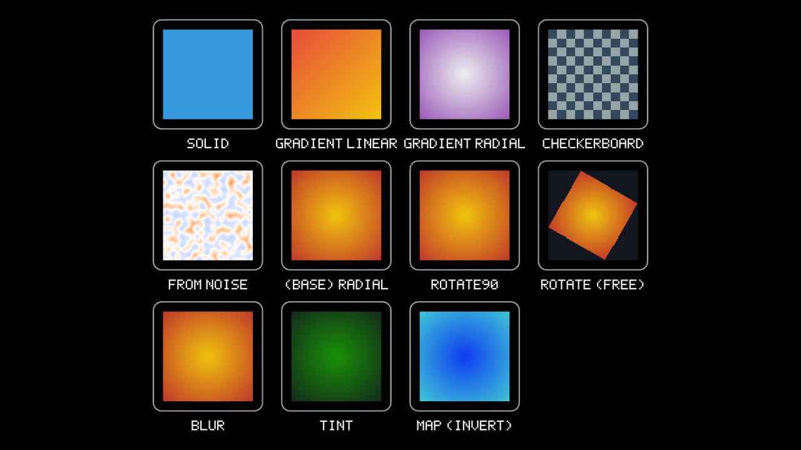

# TextureUtil — Guide

`TextureUtil` (namespace `MonoPrimitives`, file [`src/Core/TextureUtil.cs`](../src/Core/TextureUtil.cs)) generates procedural textures and transforms existing ones — the CPU pixel-buffer utilities MonoGame's own `Texture2D` doesn't provide.


<br><sub>The bottom three rows all start from the same `(BASE) RADIAL` gradient texture.</sub>

## Quick start

```csharp
using MonoPrimitives;

// A gradient sky texture, generated once at startup.
_sky = TextureUtil.CreateGradientLinear(GraphicsDevice, 256, 256, Color.MidnightBlue, Color.CornflowerBlue, angle: MathHelper.PiOver2);

// A terrain texture straight from this library's own Noise class.
var noise = new Noise(seed: 1234, octaves: 4);
_terrain = TextureUtil.CreateFromNoise(GraphicsDevice, 512, 512, noise, scale: 0.02f,
    colorMap: v => v < 0.4f ? Color.DarkBlue : v < 0.5f ? Color.SandyBrown : Color.ForestGreen);
```

## API

**Generation** — each returns a new `Texture2D` (`SurfaceFormat.Color`), no state kept around afterward:

| Member | What it does |
|---|---|
| `CreateSolid(device, width, height, color)` | A texture filled with one color. |
| `CreateGradientLinear(device, width, height, colorA, colorB, angle)` | Linear blend along `angle` (radians; `0` = left-to-right, increasing rotates counter-clockwise). |
| `CreateGradientRadial(device, width, height, innerColor, outerColor)` | Radial blend, `innerColor` at the center fading to `outerColor` at the corners. |
| `CreateCheckerboard(device, width, height, cellSize, colorA, colorB)` | Alternating `cellSize`-pixel square cells. |
| `CreateFromNoise(device, width, height, noise, scale, colorMap)` | Samples a `Noise` instance once per pixel at `(x,y) * scale`, remapped from its own roughly `[-1,1]` output to `[0,1]` before your optional `colorMap` (grayscale by default). |

**Transforms** — each takes an existing `Texture2D`/`RenderTarget2D` and returns a new, independent one:

| Member | What it does |
|---|---|
| `Crop(device, source, sourceRectangle)` | Extracts a sub-rectangle. Throws `ArgumentOutOfRangeException` if it doesn't lie within `source`. |
| `FlipHorizontal(device, source)` / `FlipVertical(device, source)` | Mirrors the pixels. |
| `Rotate90(device, source, clockwise)` | Exact quarter turn, swapping width/height — no resampling. |
| `Rotate(device, source, radians, smooth, backgroundColor)` | Arbitrary-angle rotation. The canvas grows to fit the whole rotated image (no cropping); `backgroundColor` (transparent by default) fills the corners the rotated image doesn't cover. |
| `Tint(device, source, tintColor)` | Multiplies every pixel by `tintColor` (`ColorUtil.Multiply`). |
| `Map(device, source, map)` | Applies any `Func<Color,Color>` to every pixel — grayscale/invert/brightness/contrast/color-remap, all the same shape. Compose with `ColorUtil`: `TextureUtil.Map(device, src, ColorUtil.Invert)`. |
| `Blur(device, source, radius)` | Separable Gaussian blur. Blurs in premultiplied-alpha space so a blurred transparent edge doesn't pick up color bleed from fully-transparent neighbors. `O(width * height * radius)` — real work at a large radius, not a per-frame operation. |
| `Resize(device, source, newWidth, newHeight, smooth)` | Resamples to a new size — bilinear (`smooth: true`, the default) or nearest-neighbor (`false`, for pixel art). |
| `Combine(device, background, overlay, offset)` | Draws `overlay` onto a copy of `background` at `offset`, alpha-blended. Result is `background`'s size. |
| `ToTexture2D(device, renderTarget)` | Snapshots a `RenderTarget2D`'s current contents into a plain, independent `Texture2D` — survives the render target being cleared, resized, or disposed. |

## Notes

- `Crop`/`FlipHorizontal`/`FlipVertical`/`Rotate90`/`Tint`/`Map`/`Blur` (and every generator) are CPU-only — they build a `Color[]` and upload it once via `SetData`. `Resize`/`Rotate`/`Combine` render through a temporary `RenderTarget2D` instead, since resampling and alpha-blending are what the GPU already does correctly.
- `Resize`/`Rotate`/`Combine` save and restore the device's currently-active render target, so calling any of them mid-frame (e.g. lazily generating a texture inside your own `Draw()`) won't redirect the rest of that frame's rendering somewhere unexpected.
- None of this is meant for a per-frame hot path — generate once at startup (or lazily, the first time you need a given texture) and keep the result, the same way you'd treat any other `Texture2D` you loaded from disk. `Blur` in particular is real per-pixel-per-kernel-tap work; don't call it every frame on a large texture.
