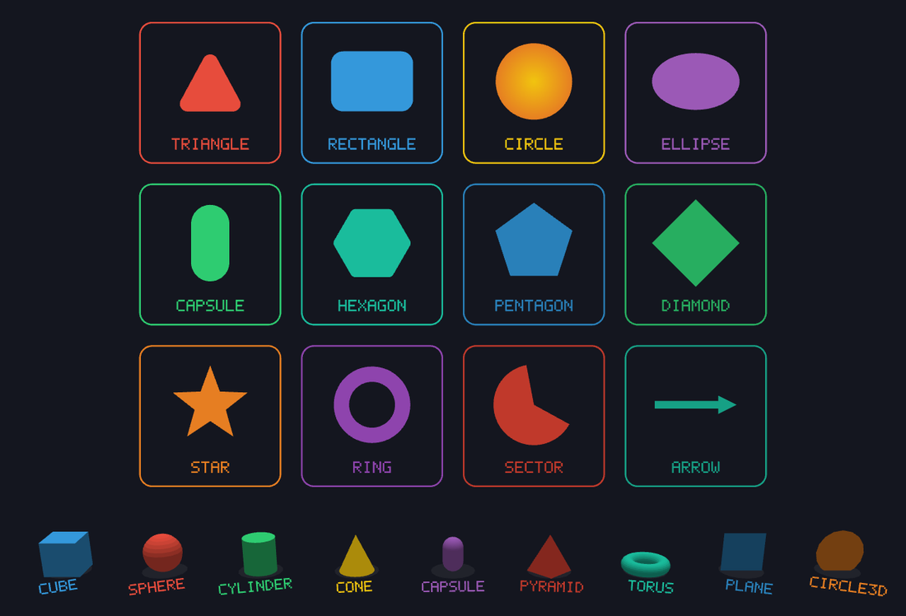
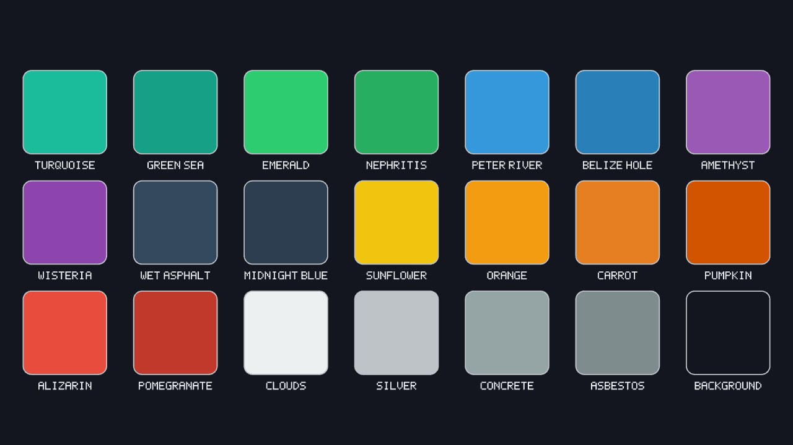

# MonoPrimitives

[](https://www.nuget.org/packages/MonoPrimitives)
[](LICENSE)



Immediate-mode 2D and 3D primitive drawing for MonoGame, plus the handful of things every prototype ends up needing anyway — camera, input, easing, color, noise, collision checks. One package instead of stitching together five.

Built for prototypes and small games: boids, cellular automata, terrain, generative art, retro-style demos. It's not a game engine and it's not trying to ship your next commercial title.

## Install

```bash
dotnet add package MonoPrimitives
```

Or grab the starter template — letterboxed 1080p, MSAA, input, a camera, all wired up already. It's not on NuGet yet, so install it from a clone of this repo for now:

```bash
dotnet new install ./templates/PrimitiveBase
dotnet new primitivebase -n YourGame
```

It's one package and one DLL, 2D and 3D both included. Under the hood it's split into three namespaces so nothing overlaps:

| Namespace | Source folder | What's there |
|---|---|---|
| `MonoPrimitives` | `src/Core/` | Shared: `PrimitiveInput`, `Easing`, `Palette`/`ColorUtil`, `Noise`, `RandomUtil`, `FontGlyphs5x7`, `Vector2Extensions`, `RectangleF`, `FrameLimiter`, `FastTexture`, `FpsCounter`, `ScreenshotUtil`, `ObjectPool<T>`, `RingBuffer<T>`, `Cooldown` |
| `MonoPrimitives.Primitives2D` | `src/2D/` | `Primitive2DBatch`, `Camera2D` + `ViewportAdapter2D`, `Collision2D`, `Trail2D`, `UnitCircleLut` |
| `MonoPrimitives.Primitives3D` | `src/3D/` | `Primitive3DBatch`, `Camera3D`, `Collision3D`, `Trail3D`, `TrigLut`, `Vector3Extensions` |

## Quick start

```csharp
using MonoPrimitives.Primitives2D;

private Primitive2DBatch _batch;

protected override void LoadContent()
{
    _batch = new Primitive2DBatch(GraphicsDevice);
}

protected override void Draw(GameTime gameTime)
{
    _batch.Begin();
    _batch.FillCircle(new Vector2(400, 300), 50, Color.Red);
    _batch.DrawRectangle(100, 100, 200, 80, Color.White, Color.Black, thickness: 4);
    _batch.End();
    base.Draw(gameTime);
}
```

```csharp
using MonoPrimitives.Primitives3D;

private Primitive3DBatch _batch;
private Camera3D _camera;

protected override void LoadContent()
{
    _batch = new Primitive3DBatch(GraphicsDevice);
    _camera = new Camera3D(
        position: new Vector3(6, 6, 6),
        target: Vector3.Zero,
        up: Vector3.Up,
        fovy: 50f
        );
}

protected override void Draw(GameTime gameTime)
{
    _batch.Begin(_camera);
    _batch.FillSphere(Vector3.Zero, 1f, Color.Red);
    _batch.End();
    base.Draw(gameTime);
}
```

Every shape follows the same pattern, 2D and 3D alike: `Fill<Shape>` for solid, `Border<Shape>` for an outline (grows inward), `Draw<Shape>` for both.

## Documentation

Each class has its own guide. Start with whichever covers what you're building, or check [`Guide/README.md`](Guide/README.md) if you want a suggested reading order.

**Drawing**
- [`Primitive2DBatch`](Guide/Primitive2DBatch_Guide.md) — every 2D shape (rectangles, circles, ellipses, capsules, polygons, sectors/rings, splines), gradients, shadows, rounded/chamfered corners.
- [`Primitive3DBatch`](Guide/Primitive3DBatch_Guide.md) — every 3D shape (cubes, spheres, cylinders, capsules, torus, planes, heightmaps), flat-shading lighting, splines.
- [`DebugFont5x7`](Guide/DebugFont5x7_Guide.md) — a built-in bitmap debug font, 2D and 3D (billboarded).

**Camera & viewport**
- [`Camera2D & Viewport`](Guide/Camera2D_Guide.md) — pan/rotate/zoom, bounds, follow, shake, and the `ViewportAdapter2D` family for resolution-independent letterboxing/scaling.
- [`Camera3D`](Guide/Camera3D_Guide.md) — the 3D counterpart: 5 behaviour modes, free-fly/orbit/first-/third-person controllers.

**Input**
- [`PrimitiveInput`](Guide/PrimitiveInput_Guide.md) — keyboard/mouse/gamepad polling, vibration, typed text, and raw `KeyboardState`/`MouseState`/`GamePadState` access for whatever isn't wrapped.

**Collision**
- [`Collision2D`](Guide/Collision2D_Guide.md) — every 2D overlap/ray check by shape.
- [`PolygonUtil`](Guide/PolygonUtil_Guide.md) — `IsConvex` (does my polygon qualify for SAT?) and `Triangulate` (ear clipping, for your own mesh/collision/nav data).
- [`Collision3D`](Guide/Collision3D_Guide.md) — sphere/box/capsule/plane/triangle/quad overlap and raycasts.

**Math & utilities**
- [`MathUtil`](Guide/MathUtil_Guide.md) — `Remap`/`DeltaAngle`/`LerpAngle`/`PingPong`, the scalar helpers `MathHelper` doesn't have.
- [`Easing`](Guide/Easing_Guide.md) — 31 tweening curves for one-shot animations with a known duration.
- [`Noise`](Guide/Noise_Guide.md) — seedable Perlin noise, fBm, ridge, and turbulence.
- [`RandomUtil`](Guide/RandomUtil_Guide.md) — seedable distribution sampling (Gaussian, Poisson, Binomial, uniform disc/sphere, weighted picks).
- [`Color`](Guide/Color_Guide.md) — a curated color palette plus hex/HSV conversion and adjustment.
- [`Trail`](Guide/Trail2D_Guide.md) — a fading position-history trail, 2D and 3D.
- [`UnitCircleLut`](Guide/UnitCircleLut_Guide.md) / [`TrigLut`](Guide/TrigLut_Guide.md) — trig-free lookup tables, the same ones the shape batches use internally, for your own curved geometry.
- [`VectorExtensions`](Guide/Vector2Extensions_Guide.md) — angle/rotation/approach/clamp helpers on MonoGame's own `Vector2`, plus `Vector3Extensions` (3D) in the same guide.
- [`RectangleF`](Guide/RectangleF_Guide.md) — a float-precision counterpart to MonoGame's integer-only `Rectangle`.
- [`RingBuffer`](Guide/RingBuffer_Guide.md) — a generic fixed-capacity ring buffer for a history, log, or sample window.
- [`ObjectPool`](Guide/ObjectPool_Guide.md) — a generic object pool for anything spawned and discarded often enough to want reuse over reallocation.

**App helpers**
- [`FrameLimiter`](Guide/FrameLimiter_Guide.md) — sleep+spin frame pacing, more precise than `IsFixedTimeStep` alone.
- [`FastTexture`](Guide/FastTexture_Guide.md) — raw-GL texture upload, 2.5-2.7x faster than `SetData` for frequent updates.
- [`FpsCounter`](Guide/FpsCounter_Guide.md) — rolling-average FPS measurement.
- [`ScreenshotUtil`](Guide/ScreenshotUtil_Guide.md) — one-call back-buffer capture to `.png`/`.jpg`.
- [`TextureUtil`](Guide/TextureUtil_Guide.md) — procedural texture generation (solid/gradient/checkerboard/from `Noise`) plus resize/crop/flip/tint/combine transforms.
- [`Cooldown`](Guide/Cooldown_Guide.md) — a simple countdown struct for attack cooldowns, spawn timers, input debouncing.
- [`WindowUtil`](Guide/WindowUtil_Guide.md) — minimize/maximize/restore, opacity, window icon, multi-monitor info, clipboard text, and captured-cursor mouse-look.

Curious about the internals — architecture, conventions, why something works the way it does? That's in [`Design/README.md`](Design/README.md).



## Examples

- [`samples/MonoPrimitives.Sample`](samples/MonoPrimitives.Sample) — a visual-regression gallery of every 2D and 3D shape, camera-controlled.
- [`examples/test/`](examples/test) — one focused demo per non-drawing component: collision, input, viewport adapters, noise, particle trails, text.
- [`examples/demos/`](examples/demos) — small complete games built on the library (Breakout, Tetris, Asteroids in 2D and 3D, a platformer, Snake, a boids simulation).

## What this isn't

- **No physics resolution** — collision checks detect overlaps, they never resolve them.
- **No texture/model loading, no window management** — that's MonoGame's own `Game`/content pipeline.
- **No scene graph** — every draw call is immediate; nothing is retained between frames.

## Inspiration

A few places this borrows from directly, credit where it's due:

- **[Apos.Shapes](https://github.com/Apostolique/Apos.Shapes)** — where the `Fill`/`Border`/`Draw` naming came from.
- **[raylib](https://www.raylib.com/)** — the biggest influence overall. `Camera3D` is basically a C# port of `rcamera.h`, and `Collision3D` follows raylib's collision module pretty closely (naming included).
- **[raylib-cs](https://github.com/raylib-cs/raylib-cs)** — the reason this uses MonoGame's own `Vector2`/`Vector3`/`Color` instead of rolling its own math types, same call raylib-cs made for raylib's C bindings.
- **[MonoGame.Extended](https://github.com/craftworkgames/MonoGame.Extended)** — `Camera2D`/`ViewportAdapter2D` follows its `OrthographicCamera`/`ViewportAdapter` split.
- **[Godot](https://godotengine.org/)** — a few specific methods are checked against it where raylib doesn't have an answer: `PrimitiveInput.GetAxis`, the debug font's billboard behavior, `RandomUtil.NextWeightedIndex`.
- **[libGDX](https://libgdx.com/)** — `PolygonUtil.Triangulate` matches its ear-clipping triangulator, and `CoverViewportAdapter2D` is the same idea as its `Scaling.fill`.
- **[Processing](https://processing.org/) / [p5.js](https://p5js.org/)** — the underlying philosophy: one call, no setup, fast enough to try an idea in a sketch instead of a project.

None of these are dependencies — MonoPrimitives only needs MonoGame itself.

## Status

Published on NuGet, pre-1.0 — expect some API churn until the gaps close. [`Design/ROADMAP.md`](Design/ROADMAP.md) has what's known-missing and deliberately deferred; [`CHANGELOG.md`](CHANGELOG.md) has what changed in each version.

## License

MIT — see [`LICENSE`](LICENSE).
